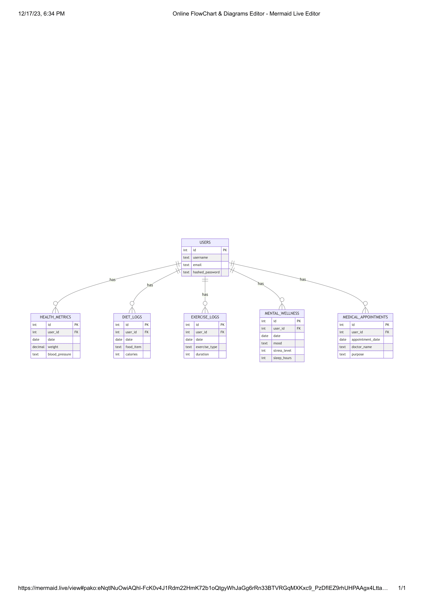

# Health and Wellness Tracking System

By Manjot Singh Sran

Video overview: https://youtu.be/VsxLDmB3RGA

## Scope

### Purpose
The Health and Wellness Tracking System is designed to enable users to monitor various aspects of their health and wellness journey, including diet, exercise, mental health, and medical appointments.

### In Scope
- User profiles with health and wellness data
- Tracking daily diet and calorie intake
- Logging exercise routines
- Monitoring mental health parameters
- Managing medical appointments

### Out of Scope
- Medical diagnosis or treatment advice
- Integration with medical devices or external health services
- Real-time health monitoring

## Functional Requirements

### User Capabilities
- Create and manage personal profiles
- Record and track health metrics like weight and blood pressure
- Log daily diet and exercise routines
- Monitor mental health and sleep patterns
- Schedule and keep track of medical appointments

### Beyond Scope
- Providing medical diagnoses or professional health advice
- Synchronization with wearable health devices

## Representation

### Entities

#### Users
- Attributes: ID, Username, Email, Password
- Types: INTEGER, TEXT
- Constraints: ID is PRIMARY KEY, Username is UNIQUE
- Rationale: User identification and login functionality

#### Health Metrics
- Attributes: ID, User ID, Date, Weight, Blood Pressure
- Types: INTEGER, DATE, DECIMAL, TEXT
- Constraints: ID is PRIMARY KEY, User ID is FOREIGN KEY
- Rationale: Track health changes over time linked to user

#### Diet Logs
- Attributes: ID, User ID, Date, Food Item, Calories
- Types: INTEGER, DATE, TEXT, INTEGER
- Constraints: ID is PRIMARY KEY, User ID is FOREIGN KEY
- Rationale: Record and analyze dietary habits for health monitoring

#### Exercise Logs
- Attributes: ID, User ID, Date, Exercise Type, Duration
- Types: INTEGER, DATE, TEXT, INTEGER
- Constraints: ID is PRIMARY KEY, User ID is FOREIGN KEY
- Rationale: Keep track of physical activities for fitness and health goals

#### Mental Wellness
- Attributes: ID, User ID, Date, Mood, Stress Level, Sleep Hours
- Types: INTEGER, DATE, TEXT, INTEGER, INTEGER
- Constraints: ID is PRIMARY KEY, User ID is FOREIGN KEY
- Rationale: Monitor mental health parameters for overall well-being

#### Medical Appointments
- Attributes: ID, User ID, Appointment Date, Doctor Name, Purpose
- Types: INTEGER, DATE, TEXT, TEXT
- Constraints: ID is PRIMARY KEY, User ID is FOREIGN KEY
- Rationale: Manage medical appointments for maintaining health records

### Relationships

### ER Diagram

The ER Diagram represents the following entities and relationships in the database:

- **USERS**: This is the central entity representing the system's users. It has attributes such as `id` (primary key), `username`, `email`, and `hashed_password`.

- **HEALTH_METRICS**: Records health-related data for each user over time, with attributes including `id`, `user_id` (foreign key), `date`, `weight`, and `blood_pressure`. Each user can have multiple health metric records, indicating a one-to-many relationship with USERS.

- **DIET_LOGS**: Tracks the daily food and calorie intake of users. Attributes include `id`, `user_id`, `date`, `food_item`, and `calories`. Similar to HEALTH_METRICS, it has a one-to-many relationship with USERS.

- **EXERCISE_LOGS**: Contains records of workout sessions and types of exercises for each user. It includes `id`, `user_id`, `date`, `exercise_type`, and `duration`, maintaining a one-to-many relationship with USERS.

- **MENTAL_WELLNESS**: This entity tracks mood and stress levels, along with sleep patterns. Its attributes are `id`, `user_id`, `date`, `mood`, `stress_level`, and `sleep_hours`. It follows the one-to-many relationship pattern with USERS.

- **MEDICAL_APPOINTMENTS**: Manages information about users' medical appointments. It comprises `id`, `user_id`, `appointment_date`, `doctor_name`, and `purpose`. This entity also relates to USERS in a one-to-many fashion.

Each entity is interconnected, primarily through the `user_id` attribute, acting as a foreign key that links back to the USERS entity. This design supports the system's functionality by maintaining comprehensive records for each user across various health and wellness aspects.

## Optimizations

- Indexes on user_id in all related tables for faster query performance.
- Views for aggregating common health trends and summaries.

## Limitations

- Cannot provide real-time health tracking or emergency alerts.
- Limited in representing complex medical histories or conditions.
